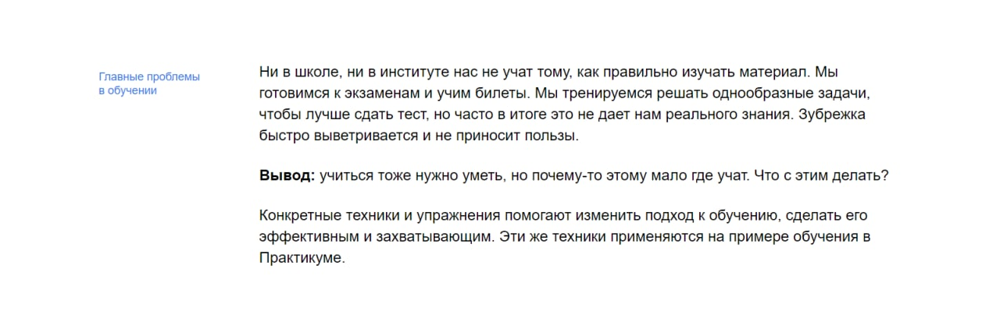

# Научиться учиться
Сайт в помощь обучающимся. Набор подсказок по упрощению процесса обучения.

## Функционал
* Анимация элементов страницы средствами CSS
* Встраивание видеоконтента тегом iframe
## Технологии
* HTML
* CSS
* CSS Animation
* Позиционирование элементов
* Flexbox
* Методолгоия БЭМ